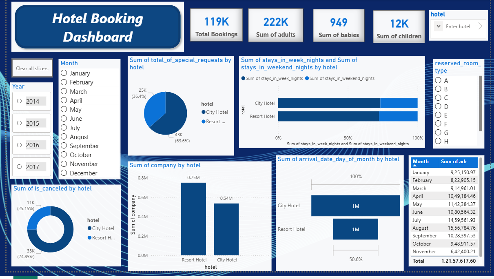

# 🏨 Hotel Booking Power BI Dashboard

## 📊 Overview
This project analyzes hotel booking data using Power BI to understand booking trends, revenue patterns, and cancellation behavior.

## 📌 Key Insights
- High cancellation rate in city hotels
- Seasonal booking trends observed across months
- Revenue variation based on room type and customer segment
- Peak booking periods identified for business optimization

## 🛠 Tools & Technologies
- Power BI Desktop
- DAX (Data Analysis Expressions)
- Data Visualization
- Excel / CSV Dataset

## 📈 Dashboard Preview

## 📂 Files Included
- hotel_booking_dashboard.pbix → Power BI dashboard file
- Dataset (CSV/Excel)
- Dashboard Screenshot

## 🚀 How to Use
1. Download the `.pbix` file
2. Open it using Power BI Desktop
3. Explore dashboards and insights

## 🎯 Outcome
This project helps hotels understand customer behavior, reduce cancellations, and improve revenue strategies.
